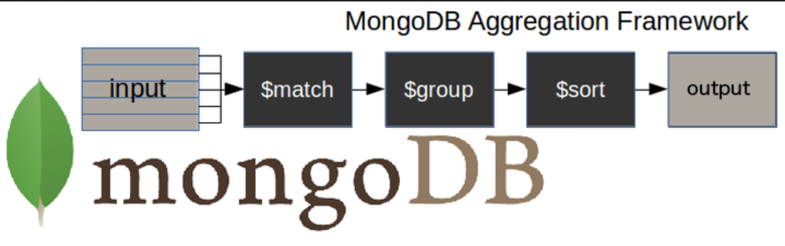
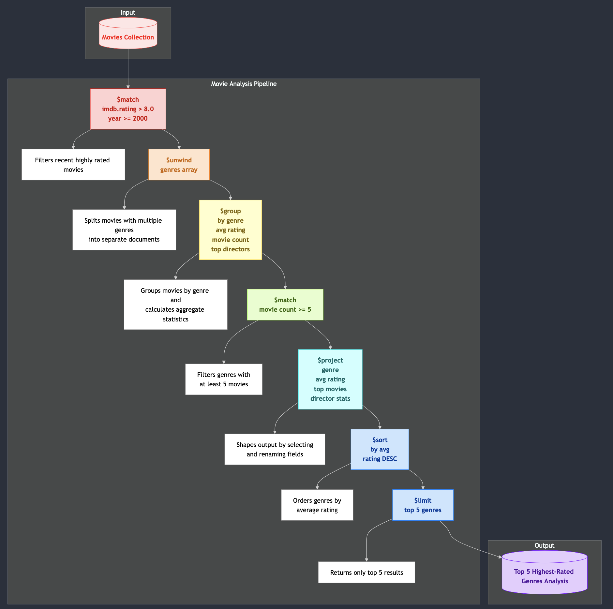

# Aggregation Pipelines - Pipelines d'agrégation

La méthode `find()` appliquée à une collection ne permet pas de faire des requetes complexes. Par exemple elle ne permet pas de regrouper ou de transformer les documents.

Il existe également des méthodes à usage unique comme `estimatedDocumentCount()`, `count()` et `distinct()` qui sont ajoutées à une requête `find()`, ce qui les rend rapides à utiliser mais aussi limitées en portée.

## Map reduce est obsolète

Jusqu'à la version 5.0, vous pouviez également utiliser le framework map-reduce sur MongoDB. Mais il est maintenant obsolète et hors de portée de ce cours.

> À partir de MongoDB 5.0, map-reduce est obsolète : au lieu de map-reduce, vous devriez utiliser un pipeline d'agrégation. Les pipelines d'agrégation offrent de meilleures performances et une meilleure convivialité que map-reduce.
> https://www.mongodb.com/docs/manual/core/map-reduce/

## composition d'un pipeline d'aggrégation

Les **pipelines d'agrégation** sont puissants !

Un **pipeline d'agrégation** est constitué d'une ou plusieurs étapes de traitement des documents.

- Chaque étape effectue une opération sur les documents d'entrée : (filtrage, regroupement, projection, transformation, ...)
- La sortie de chaque étape correspond à l'entrée de l'étape suivante.

<div style='display: left; margin-left: 30px; '>



tiré de https://studio3t.com/knowledge-base/articles/mongodb-aggregation-framework/
</div>

Principales étapes :

- étape `$match` : filtre les documents
- étape `$group` : effectue le travail d'agrégation
- étape `$sort` : trie les documents résultants dans l'ordre demandé

Un pipeline est exécuté avec la méthode `aggregate()` et une liste d'objets JSON.

```js
db.nomCollection.aggregate(pipeline, options),
```

où

```js
pipeline = [
        { $match : { … } },
        { $group : { … } },
        { $sort : { … } }
       ]
```

## Contraintes de mémoire et sorties

Les pipelines d'agrégation ont 2 contraintes de mémoire :

1. L'agrégation fonctionne en mémoire. Chaque étape peut utiliser jusqu'à 100 Mb de RAM.
2. Les documents renvoyés par la requête d'agrégation sont limités à 16 Mb.

> La sortie finale du pipeline ne peut pas être supérieure à la taille maximale d'un document MongoDB soit 16Mb.

### Retourner plus de 16 Mb

Pour contourner cette contrainte, il faut spécifier que le pipeline retourne  un **curseur** et non un document.

Par exemple :

```js
db.movies.aggregate([{ $match: {} }])
```

Ce pipeline renvoie tous les documents de la collection `movies`. Si cela risque de dépasser la limite de 16 Mo,  spécifiez que vous souhaitez renvoyer un curseur

```js
db.movies.aggregate([
  { $match: {} },
  { $project: { _id: 0, title: 1 },
], { cursor: { batchSize: 10 }})
```

Ici, `batchSize` contrôle le nombre de documents que MongoDB renvoie à chaque aller-retour sur le réseau. Cela affecte l'utilisation de la mémoire et l'efficacité du réseau :

- La valeur par défaut est de 101 documents
- Une taille de lot plus grande = moins d'allers-retours, mais plus de mémoire
- Une taille de lot plus petite = plus d'allers-retours, mais moins de mémoire
- 1000 est une valeur équilibrée courante

Cela n'affecte pas le nombre total de documents renvoyés, juste la manière dont ils sont regroupés pendant la transmission.


Attention. Si vous essayez avec un petit batchSize (3), vous verrez quand même probablement une vingtaine de resultats ! Pourquoi ?

    **Chat:**

    **Suggestion, not Dictate**: batchSize is a suggestion. MongoDB's query optimizer and internal mechanisms might decide to send a different number of documents, particularly if the overall result set is relatively small. It's more relevant when you're dealing with millions or billions of documents, where controlling network transfer is critical.

    **getMore**: Behind the scenes, when you use a cursor, mongosh fetches documents in batches. You only see all results as mongosh automatically calls getMore when it exhausts the current batch.


### créer une nouvelle collection avec $out

`$out` écrit les résultats d'un pipeline d'agrégation dans une collection déjà existante ou dans une nouvelle collection.

`$out`  doit être la dernière étape du pipeline.

par exemple

```js
db.movies.aggregate([
  { $match: { runtime: { $gt: 120 } }},
  { $out: "longMovies" }  // Crée ou écrase la collection longMovies
])
```

Collection Replacement: Be aware that $out replaces the target collection if it already exists. If you need to append to an existing collection, you'll need a more complex aggregation involving $merge and handling potential duplicates.

Indexes: The new drama_movies collection will not automatically inherit indexes from the movies collection.

**Exercice** : créez une nouvelle collection avec

- les films d'un genre particulier (par exemple 'Drama')
- réduisez les chanmps, en gardant que le titre, le genre, la durée et le score IMDB


### Créer un nouveau champ avec $addFields

Utilisez `$addFields` pour créer de nouveaux champs.

Par exemple, ce pipeline ajoute un champ `budgetCategory` basé sur le `budget` de l'arbre

```js
db.movies.aggregate([
 { $addFields: {
   budgetCategory: {
     $switch: {
       branches: [
         { case: { $gte: ["$budget", 100000000] }, then: "blockbuster" },
         { case: { $gte: ["$budget", 50000000] }, then: "big-budget" },
         { case: { $gte: ["$budget", 10000000] }, then: "medium-budget" }
       ],
       default: "low-budget"
     }
   }
 }}
])
```

Notez l'utilisation de l'opérateur `$switch`.

#### Calculs sur des champs

Créons  un champ `profitMargin` calculé comme

```formula
profitMargin = ((revenu - budget) / budget) * 100
```

Vous devez utiliser les opérateurs [`$subtract`](https://www.mongodb.com/docs/manual/reference/operator/aggregation/substr/), [`$divide`](https://www.mongodb.com/docs/manual/reference/operator/aggregation/divide/) et [`$multiply`](https://www.mongodb.com/docs/manual/reference/operator/aggregation/multiply/), vous ne pouvez pas simplement utiliser une soustraction, une division ou une multiplication directe.

```js
{ $substract: [ <expression1>, <expression2> ] },
{ $divide: [ <expression1>, <expression2> ] },
{ $multiply: [ <expression1>, <expression2> ] },
```

Simple soustraction et création d'un champs `profit`

```js
db.movies.aggregate([
{
  $addFields: {
    profit: {
      {  $subtract: ["$revenue", "$budget"] }
    }
  }
}
])
```


Maintenant, le calcul en entier  et création d'un nouveau champs `profitMargin`:

profitMargin = ((revenu - budget) / budget) * 100

```js
db.movies.aggregate([
 {
  $addFields: {
   profitMargin: {
       { $multiply: [
          { $divide:
            [
              { $subtract: ["$revenue", "$budget"] },
              "$budget"
            ]},
          100
        ]}
   }
 }}
])
```


Consultez la documentation pour tous les opérateurs : <https://www.mongodb.com/docs/manual/reference/operator/aggregation/>

### Faire que le champs soit permanent

Le nouveau champs créé par $addFields n'est que temporaire, il n'est pas ajouté a la collection.


Pour cela il faut utiliser

- updateMany()
- $set

comme cela


```js
db.movies.updateMany(
  {},
  [
    {
      $set: {
        profitMargin: {
          $multiply: [
            {
              $divide: [
                { $subtract: ["$revenue", "$budget"] },
                "$budget"
              ]
            },
            100
          ]
        }
      }
    }
  ]
);

```


## Exercice: Nouveau label en fct IMDB rating

Créez un nouveau champs `label` temporaire


mapping du imdb.rating a un label : de A a E avec

- A : imdb.rating >8
- B:  imdb.rating <8 and  imdb.rating >7
- etc


Si on veut compter le nombre de film par label, le pipeline utilise `$group`


```js
db.movies.aggregate([
  {
    $group: {
      _id: "$label",  // Group by the existing label field
      count: { $sum: 1 }  // Count documents in each group
    }
  },
  {
    $project: {
      _id: 0,  // Exclude the _id field
      label: "$_id",  // Rename _id to label
      count: 1  // Include the count
    }
  },
  {
    $sort: {
      label: 1  // Sort by label (optional)
    }
  }
]);
```


Et donne les résultats suivants


```
[
  { count: 1028, label: 'A' },
  { count: 7193, label: 'B' },
  { count: 8309, label: 'C' },
  { count: 3464, label: 'D' },
  { count: 1355, label: 'E' }
]
```


### $unwind : travailler sur chaque élément d'un tableau

Vous ne pouvez pas travailler directement sur les éléments d'un tableau dans un document avec des étapes telles que `$group`. L'étape `$unwind` nous permet de travailler avec les valeurs des champs d'un tableau.

Par exemple, dérouler la liste  d'acteurs en documents séparés : lister tous les acteurs inclus dans le champ `$cast`

```js
db.movies.aggregate([
 { $match: { "cast": { $exists: true } }},
 { $unwind: "$cast" },
 { $project: {
   _id: 0,
   title: 1,
   actor: "$cast"
 }}
])
```


### Pratique

À votre tour : écrivez un pipeline qui crée un `weightedScore` normalisé à partir des notes IMDb et Metacritic,

`weightedScore = (imdb.rating / 10) * (metacritic / 100)`

puis l'utilise pour le filtrage (weightedScore > 0,7) et le tri (desc).

```js
db.movies.aggregate([
  // Ajouter un champ de score pondéré combinant IMDb et Metacritic
  { $addFields: {
      weightedScore: {
        $multiply: [
          { $divide: ["$imdb.rating", 10] },
          { $divide: ["$metacritic", 100] }
        ]
      }
  }},

  // Utiliser le score pondéré pour filtrer
  { $match: {
      weightedScore: { $gt: 0.7 }
  }},

  // Trier par ce nouveau score
  { $sort: { weightedScore: -1 }}
])
```

### Regroupement

Calculer la `imdb.rating` moyenne par genre

Ceci regroupe les films par leur note MPAA et calcule :

- Nombre de films par note (count)
- Score IMDb moyen pour chaque note (avgRating)

```js
db.movies.aggregate([
  { $group: {
      _id: "$rated",           // Regrouper par note (PG, R, etc.)
      count: { $sum: 1 },      // Compter les films dans chaque groupe
      cumulative_rating: { $sum: "$imdb.rating" },      // Compter les films dans chaque groupe
      avgRating: { $avg: "$imdb.rating" }  // Note IMDb moyenne
  }}
])
```

Notez `{$sum : 1}` pour compter les films dans chaque groupe.

vous pouvez également utiliser : `$count`

```js
db.movies.aggregate([
  { $group: {
      _id: "$rated",
      movieCount: { $count: {} },     // Compter les films dans chaque groupe
      avgRating: { $avg: "$imdb.rating" }
  }}
])
```

#### Opérateurs d'agrégation $group

L'étape `$group` prend en charge certaines expressions (opérateurs) pour faire des opérations arithmétiques, de tableau, booléennes et autres dans le cadre du pipeline d'agrégation.


| Opérateur | Signification                                                             |
| --------- | ------------------------------------------------------------------------- |
| $count    | Calcule la quantité de documents dans le groupe donné.                    |
| $max      | Affiche la valeur maximale d'un champ d'un document dans la collection.   |
| $min      | Affiche la valeur minimale d'un champ d'un document dans la collection.   |
| $avg      | Affiche la valeur moyenne d'un champ d'un document dans la collection.    |
| $sum      | Additionne les valeurs spécifiées de tous les documents de la collection. |
| $push     | Ajoute des valeurs supplémentaires dans le tableau du document résultant. |

#### $push

`$push` crée un champ de tableau qui collecte toutes les valeurs des documents groupés. C'est comme créer une liste de valeurs à partir de plusieurs documents dans un seul tableau.

par exemple:

```js
{ $push: "$title" }  // Crée un tableau de tous les titres du groupe
```

ou

```js
db.movies.aggregate([
 // Regrouper les films par réalisateur
 { $group: {
     _id: "$directors",
     directorMovies: {
         $push: {    // Créer un tableau de films pour chaque réalisateur
             title: "$title",
             year: "$year",
             rating: "$imdb.rating"
         }
     }
 }},
 // Filtrer les réalisateurs avec 3 films ou plus
 { $match: {
     "directorMovies.3": { $exists: true }
 }},
 // Trier par nombre de films
 { $sort: {
     "directorMovies": -1
 }}
])
```

à votre tour :

- utiliser `$push` pour lister la note MPAA par genre

```js
db.movies.aggregate([
 { $unwind: "$genres" },
 { $group: {
     _id: "$genres",
     ratings: { $push: "$rated" }
 }},
 { $sort: { _id: 1 }}
])
```

Différence avec l'utilisation de `{ $addToSet: "$rated" }` au lieu de `{ $push: "$rated" }` ?


### Exercice : Mixer $unwind, $group, $addField

À votre tour : utilisez $addField et $unwind pour créer le pipeline suivant

- Sépare les films par genre
- Calcule la note moyenne par genre
- Crée un champ structuré avec des informations sur le genre
- Filtre les genres avec des notes moyennes élevées (> 7,5)
- Trie les résultats par note


### $facet pour une exécution parallèle

`$facet` vous permet d'exécuter plusieurs pipelines d'agrégation en **parallèle** et de combiner leurs sorties dans un seul document de résultat. Chaque pipeline s'exécute indépendamment sur les mêmes documents d'entrée.

```js
db.collection.aggregate([
 // Facultatif : étapes initiales avant la facette
 { $match: ... },

 { $facet: {
   "pipeline1": [
     // Étapes pour le premier pipeline parallèle
   ],
   "pipeline2": [
     // Étapes pour le deuxième pipeline parallèle
   ],
   // Plus de pipelines nommés si nécessaire
 }},

 // Facultatif : étapes post-facette pour traiter les résultats combinés
 { $project: ... }
])
```

### Exemple

Voici une requête find

```js
db.movies.find(
    { imdb.rating: { $gt: 8.0 } },
    { _id: 0, title: 1, imdb.rating: 1, released: 1 }
).sort(
    { released: -1 }
).limit(
    2
)
```

Voici le pipeline équivalent

```javascript
cursor = db.movies.aggregate([
    {
        $match: { imdb.rating: { $gt: 8.0 } }
    },
    {
        $project: {
            _id: 0,
            title : 1,
            imdb.rating: 1,
            released: 1
        }
    },
    {
        $sort: { released: -1 }
    },
    {
        $limit: 2
    }
])
```

## Un pipeline d'agrégation plus complexe



qui correspond au pipeline

```bash
db.movies.aggregate([
    {
        "$match": {
            "imdb.rating": { "$gt": 8.0 },
            "year": { "$gte": 2000 }
        }
    },
    {
        "$unwind": "$genres"
    },
    {
        "$group": {
            "_id": "$genres",
            "averageRating": { "$avg": "$imdb.rating" },
            "movieCount": { "$sum": 1 },
            "topDirectors": {
                "$push": {
                    "director": "$directors",
                    "movie": "$title",
                    "rating": "$imdb.rating"
                }
            }
        }
    },
    {
        "$match": {
            "movieCount": { "$gte": 5 }
        }
    },
    {
        "$project": {
            "_id": 0,
            "genre": "$_id",
            "averageRating": 1,
            "movieCount": 1,
            "topMovies": { "$slice": ["$topDirectors", 3] }
        }
    },
    {
        "$sort": {
            "averageRating": -1
        }
    },
    {
        "$limit": 5
    }
])
```

### Jointures et $lookups

Dans MongoDB, les jointures sur les collections sont obtenues avec `$lookup`.

Voici un exemple de jointure des films avec leurs commentaires en utilisant une étape `$lookup`.

```bash
db.movies.aggregate([
    {
        $lookup: {
            from: "comments",           // La collection à joindre
            localField: "_id",          // Le champ de la collection `movies`
            foreignField: "movie_id",   // Le champ de la collection `comments`
            as: "movie_comments"        // Nom du tableau résultant
        }
    },
    {
        $match: {                      // Filtrer les films pour inclure uniquement ceux qui ont une note IMDb élevée
            "imdb.rating": { $gte: 8 }
        }
    },
    {
        $project: {                    // Projeter uniquement les champs d'intérêt
            _id: 0,
            title: 1,
            "imdb.rating": 1,
            movie_comments: 1
        }
    }
])
```

Si nous voulons

- ne renvoyer que les films avec des commentaires
- et ne renvoyer qu'un maximum de 2 commentaires par film

```javascript
db.movies.aggregate([
    {
        $lookup: {
            from: "comments",           // La collection à joindre
            localField: "_id",          // Le champ de la collection movies
            foreignField: "movie_id",   // Le champ de la collection comments
            as: "movie_comments"        // Le champ de tableau résultant
        }
    },
    {
        $addFields: {
            movie_comments: { $slice: ["$movie_comments", 2] }  // Limiter les commentaires à 2
        }
    },
    {
        $match: {                      // N'inclure que les films avec au moins 1 commentaire
            movie_comments: { $ne: [] }
        }
    },
    {
        $project: {                    // Projeter uniquement les champs d'intérêt
            _id: 0,
            title: 1,
            movie_comments: 1
        }
    }
])
```

- $lookup :
  - Joint la collection movies avec la collection comments en fonction de `_id` dans movies et de `movie_id` dans comments.
  - Ajoute un champ de tableau `movie_comments` contenant tous les commentaires pour chaque film.
- $addFields :
  - Utilise `$slice` pour limiter le tableau `movie_comments` à un maximum de 2 commentaires.
- $match :
  - Filtre les films sans commentaire en veillant à ce que movie_comments ne soit pas un tableau vide (`$ne : []`).
- $project :
  - Spécifie les champs à inclure dans le résultat final, tels que le titre et movie_comments.

#### Entraînons-nous

Et construisons le pipeline pour la requête :

> Trouver tous les films avec leurs commentaires et les détails des commentateurs, en affichant uniquement les films qui ont au moins un commentaire, triés par nombre de commentaires. et ajouter le nombre de commentaires comme nouveau champ

##### Commencez par

- obtenir le titre, l'année et les commentaires du film
- limiter à 3 films

```bash
db.movies.aggregate([
  {
    $lookup: {
      from: "comments",
      localField: "_id",
      foreignField: "movie_id",
      as: "movie_comments"
    }
  },
  {
    $project: {
      title: 1,
      year: 1,
      comments: "$movie_comments.text"
    }
  },
  {
    $limit: 3
  }
])
```

Cela renvoie des films avec de nombreux commentaires vides

- au moins un commentaire

ajouter une condition pour qu'il renvoie les films avec au moins un commentaire (tableaux non vides)

```bash
db.movies.aggregate([
  {
    $lookup: {
      from: "comments",
      localField: "_id",
      foreignField: "movie_id",
      as: "movie_comments"
    }
  },
  {
    $project: {
      title: 1,
      year: 1,
      comments: "$movie_comments.text"
    }
  },
  {
    $match : {
        comments : { $ne: [] }
    }
  },
  {
    $limit: 3
  }
])
```

- ajouter le nombre de commentaires comme nouveau champ

```bash
db.movies.aggregate([
  {
    $lookup: {
      from: "comments",
      localField: "_id",
      foreignField: "movie_id",
      as: "movie_comments"
    }
  },
  {
    $project: {
      title: 1,
      year: 1,
      comments: "$movie_comments.text"
    }
  },
  {
    $match : {
        comments : { $ne: [] }
    }
  },
  {
    $limit: 3
  }
])
```


### Liens

- [tutoriel sur le pipeline d'agrégation](https://www.mongodb.com/docs/languages/python/pymongo-driver/current/aggregation/aggregation-tutorials/group-total/)

voir aussi

- pipeline d'agrégation https://www.mongodb.com/docs/manual/core/aggregation-pipeline/
- pipeline d'agrégation https://www.mongodb.com/resources/products/capabilities/aggregation-pipeline

- opérateurs https://www.mongodb.com/docs/manual/reference/operator/query/gt/
- curseurs https://www.mongodb.com/docs/manual/reference/method/js-cursor/

- pour CRUD en python
  - https://learn.mongodb.com/courses/mongodb-aggregation-in-python
  - https://learn.mongodb.com/learn/course/mongodb-crud-operations-in-python/lesson-3-querying-a-mongodb-collection-in-python-applications/learn?client=customer&page=2
  - https://www.mongodb.com/docs/languages/python/pymongo-driver/current/aggregation/aggregation-tutorials/
  - https://learn.mongodb.com/courses/mongodb-crud-operations-in-python
  - méthodes pour pymongo : https://pymongo.readthedocs.io/en/stable/api/pymongo/cursor.html

## Un peu de pratique

Calculons la note IMDb moyenne et le nombre total de films pour chaque année.

Nous définissons le pipeline d'agrégation

```python
pipeline = [
    {
        "$group": {
            "_id": "$year",  # Regrouper par le champ "year"
            "average_imdb_rating": {"$avg": "$imdb.rating"},  # Calculer la note IMDb moyenne
            "total_movies": {"$sum": 1}  # Compter le nombre total de films pour chaque année
        }
    },
    {
        "$sort": {"_id": 1}  # Trier par année par ordre croissant
    }
]
```

Ensuite, exécuter le pipeline d'agrégation

```python
cursor = db.movies.aggregate(pipeline)
for doc in cursor:
    print(doc)
```

nous voyons que nous avons des valeurs étranges pour les années. Des valeurs de type chaîne avec un `é` !

Alors, trouvons toutes les années étranges. Nous pouvons utiliser regex

```python
cursor = db.movies.find({"year": {"$regex": "è"}})
```

mais nous pourrions aussi vérifier le type de données du champ

```python
pipeline = [
    {"$group": {"_id": {"type": {"$type": "$year"}}, "count": {"$sum": 1}}}
]
```

Qui renvoie

```bash
{'_id': {'type': 'string'}, 'count': 35}
{'_id': {'type': 'int'}, 'count': 21314}
```

Ce qui montre que dans MongoDB, nous pouvons mélanger les types de données !

Si nous voulons éviter de compter les années qui ne sont pas des entiers, nous pouvons ajouter une clause $match.
Le pipeline initial devient

```python
pipeline = [
    {
        "$match": {  # S'assurer que "year" est un entier
            "year": { "$type": "int" }
        }
    },
    {
        "$group": {
            "_id": "$year",  # Regrouper par le champ "year"
            "average_imdb_rating": {"$avg": "$imdb.rating"},  # Calculer la note IMDb moyenne
            "total_movies": {"$sum": 1}  # Compter le nombre total de films pour chaque année
        }
    },
    {
        "$sort": {"_id": 1}  # Trier par année par ordre croissant
    }
]
```

Il semble que les vieux films soient meilleurs que les récents
