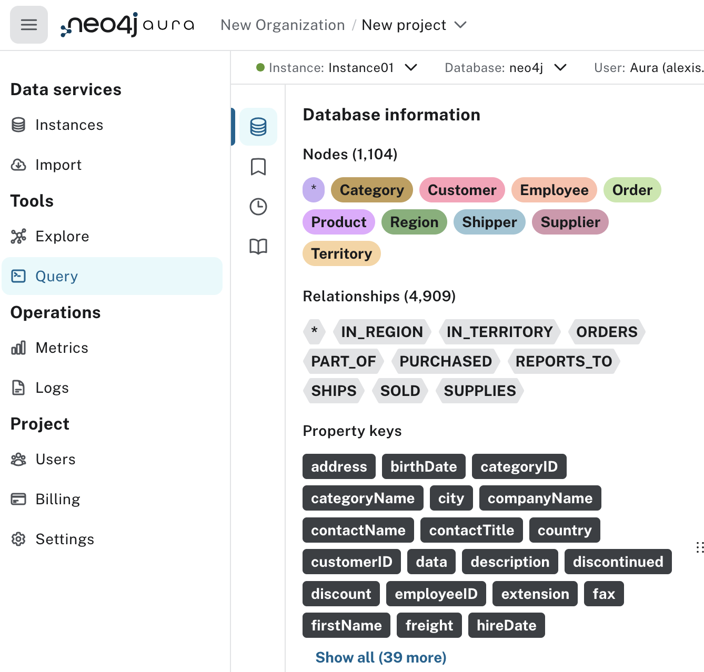
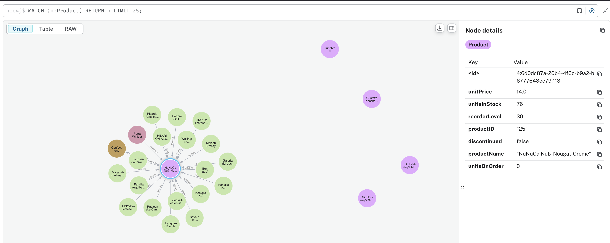
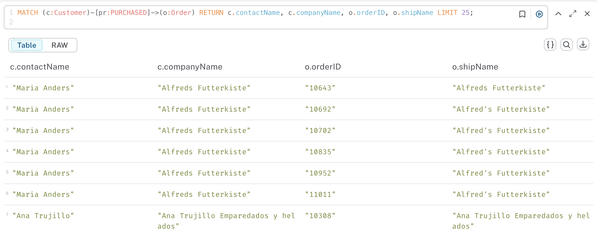

- [Neo4j Practice](#neo4j-practice)
  - [Aura db](#aura-db)
  - [Northwind dataset schema](#northwind-dataset-schema)
    - [You can see the whole model schema with](#you-can-see-the-whole-model-schema-with)
  - [Explore](#explore)
  - [Cypher query syntax](#cypher-query-syntax)
  - [Your turn](#your-turn)
    - [returning more entities](#returning-more-entities)
    - [Back to practicing](#back-to-practicing)
    - [Optional MATCH](#optional-match)
    - [Property Filters](#property-filters)
    - [Back to you](#back-to-you)
  - [Create new relationships with MERGE](#create-new-relationships-with-merge)
    - [Your turn to create a new relationship](#your-turn-to-create-a-new-relationship)
    - [Other example](#other-example)

# Neo4j Practice

## Aura db

AuraDB offers free neo4j hosting.

Create account on https://neo4j.com/product/auradb/

and then create an instance.

Finally click on the "Learn" button upper right and Query fundamentals

<div style='display: left; margin-left: 30px; '>

</div>


## Northwind dataset schema

The **Northwind dataset** is a fictional trading company database originally created by Microsoft for SQL Server tutorials. It represents a small trading company that imports and exports specialty foods.

Key entities in the Northwind dataset include:

- **Products**: Specialty food items like beverages, condiments, and seafood
- **Categories**: Product groupings (e.g., Beverages, Confections, Dairy Products)
- **Suppliers**: Companies that provide the products
- **Customers**: Companies that buy the products
- **Orders**: Purchase transactions
- **Employees**: Staff members who handle orders
- **Shippers**: Companies that deliver the orders


The relationships between these entities demonstrate:

- One-to-many relationships (e.g., a Category contains multiple Products)
- Many-to-many relationships (e.g., Orders contain multiple Products, Products appear in multiple Orders)
- Self-referential relationships (e.g., Employees have a reporting structure)

The **relationships** are defined as

- IN_REGION: a territory belongs to a region
- IN_TERRITORY: an employee is in a territory
- product is PART_OF a category
- an order ORDERS (includes) products
  - note that the relationship ORDERS has properties: unit price, quantity, discount
- a customer PURCHASED orders
- suppliers SUPPLIES products
- employees REPORT_TO employees
- an employee SOLD orders

### You can see the whole model schema with

```cypher
CALL db.schema.visualization()
```


## Explore


<div style='display: left; margin-left: 30px; '>

</div>


- Click on the PURCHASED relations and notice the query

```cypher
MATCH p=()-[:PURCHASED]->() RETURN p LIMIT 25;
```

Edit the query and remove the LIMIT 25 to see the whole graph with the PURCHASED relationship

- Click on a Product node in the sidebar and then on one of the nodes in the graph

Note the cypher query

```cypher
MATCH (n:Product) RETURN n LIMIT 25;
```

<div style='display: left; margin-left: 30px; '>

</div>


- find all the orders for all customers

A customer -  purchased -> orders


so the cypher is

```cypher
MATCH path=(c:Customer)-[pr:PURCHASED]->(o:Order) RETURN path LIMIT 25;
```

If you don't want the graph but want to return the table instead, just return the entities and relations that you need from the query.

For instance if we want to return the customer's contactName and companyName, the order's orderID and shipName, the query becomes

```cypher
MATCH (c:Customer)-[pr:PURCHASED]->(o:Order) RETURN c.contactName, c.companyName, o.orderID, o.shipName LIMIT 25;
```

and you get the table


<div style='display: left; margin-left: 30px; '>

</div>


## Cypher query syntax

A basic Cypher query follows this structure:

`MATCH [pattern]` - Define what to find in the graph
`WHERE [conditions]` - Optional: Filter the results
`RETURN [what to show]` - Specify output
`LIMIT [number]` - Optional: Restrict number of results

A **MATCH pattern** has three key components:

1. **Nodes**: In parentheses ()
   - With labels: (p:Person)
   - Properties: (p:Person {name: "John"})
   - Anonymous: ()

2. **Relationships**: In square brackets []
   - With types: -[:KNOWS]->
   - Direction: -> or <-
   - Anonymous: --

3. **Variables**: For referencing
   - Node variables: (p:Person)
   - Relationship variables: -[r:KNOWS]->
   - Path variables: path=()-->()


Filtering, ordering, limiting, coalescing, ... in cypher with the MATCH clause, is not that different from regular SQL queries syntax .

See the cheat sheet for the MATCH clause

[https://github.com/SkatAI/IPSA-NoSQL/blob/master/docs/cypher-match-cheatsheet.md](cypher-match-cheatsheet.md)


## Your turn

Knwoing the relations:

- Product PART_OF Category
- Suppliers :SUPPLIES Products
- Supplier SUPPLIES Product PART_OF Category
- Order :ORDERS Product

Write the following queries for graph and tables

- find all products over $50
- for seafood products,
  - return product name and price
  - display the graph
- Who supplies seafood product
  - return productName, unitPrice, companyName, country


### returning more entities

This query returns the graph of suppliers who supply product > $50 and their categories.

```cypher
MATCH path=(s:Supplier)-[:SUPPLIES]->(p:Product)-[:PART_OF]->(c:Category)
WHERE p.unitPrice > 50
RETURN path
```

What if we also want to see the orders for these products ?

Using `WITH`

```cypher
MATCH path=(s:Supplier)-[:SUPPLIES]->(p:Product)-[:PART_OF]->(c:Category)
WHERE p.unitPrice > 50
WITH path, p
MATCH orderPath=(o:Order)-[: ORDERS ]->(p)
RETURN path, orderPath
```

this returns the first graph of suppliers, products and their categories.
But also the orders for these products.

### Back to practicing

- Which categories have the most expensive products?
  - use `max(p.unitPrice) AS maxPrice`

- Find all orders shipped to London
- find all the products shipped to London
- Who are our top 5 customers by number of orders?

### Optional MATCH


OPTIONAL MATCH works like a regular MATCH but when no matching relationships/patterns are found, it returns NULL instead of filtering out the record.

This Returns ALL products with their orders (if they exist)


```cypher
MATCH (p:Product)
WHERE p.productName = 'Chai'
OPTIONAL MATCH (p)<-[o:ORDERS]-()
RETURN p.productName, o;
```


Will show:

- Product1, order_relationship1
- Product1, order_relationship2
- Product2, order_relationship3
- Product3, NULL  // Product with no orders
- Product4, order_relationship5

OPTIONAL MATCH is like a LEFT JOIN in SQL : it keeps records from the left side (Products) even when there's no match on the right side (Orders).


So for instance looking at order counts

```cypher
MATCH (p:Product)
WHERE p.produtName = "Aniseed Syrup"
OPTIONAL MATCH (p)<-[o:ORDERS]-()
RETURN p.productName,
       COUNT(o) as order_count;
```

### Property Filters

These queries are equivalent and provide the same results.


```cypher
MATCH (o:Order)-[:ORDERS]->(p:Product)
WHERE o.shipCity = 'London'
RETURN o.orderID, o.shipDate, p.productName, p.unitPrice
```

property pattern:

```cypher
MATCH (o:Order { shipCity : 'London' })-[:ORDERS]->(p:Product)
RETURN o.orderID, o.shipDate, p.productName, p.unitPrice
```

The property pattern is slightly more performant as it filters earlier in the query execution. However, WHERE clauses offer more flexibility for complex conditions.

### Back to you

- find all the employees reporting to mr / mrs 'Fuller'

- which product categories each supplier provides ?
  - you can omit the relations between entities
  - (s:Supplier)-->(:Product)-->(c:Category)

```cypher
MATCH (s:Supplier)-->(:Product)-->(c:Category)
RETURN s.companyName AS company, collect( DISTINCT c.categoryName) AS categories
```

## Create new relationships with MERGE


The pattern to create relationship VERB with properties

```js
MATCH <source to target relation>
WITH source, target, some way of counting
WHERE define threshold or some filtering
MERGE (source)<->r:VERB</-/>(target)
SET r.<property name> = <property value>
```


Let's create new relationships :  `FREQUENTLY_BOUGHT_WITH`: as in belong to the same order

Notice how you can point back to the product through the order.

First we find all the products that often (freq > 10) bought together.

```cypher
MATCH (p1:Product)<-[:ORDERS]-(Order)-[:ORDERS]->(p2:Product)
WHERE p1 < p2
WITH p1, p2, count(*) AS frequency
WHERE frequency > 3
return p1.productName, p2.productName, frequency
ORDER BY frequency desc
```

Let's use the results of that query to create a new relation called `FREQUENTLY_BOUGHT_WITH`
and add the property weight = frequency

We do not specify any arrows which makes the relation bidirectional

```cypher
MATCH (p1:Product)<-[:ORDERS]-(Order)-[:ORDERS]->(p2:Product)
WHERE p1 < p2
WITH p1, p2, count(*) AS frequency
WHERE frequency > 3
MERGE (p1)-[r:FREQUENTLY_BOUGHT_WITH]-(p2)
 SET r.weight= frequency
```

We see : Created 58 relationships, set 58 properties

now we can visualize the products using this relation


```cypher
MATCH p=()-[:FREQUENTLY_BOUGHT_WITH]->() RETURN p
```

### Your turn to create a new relationship

create new relations

- Employee to Employee (worked together)
  - as in employees who PROCESSED the same orders


### Other example


```js
MATCH (c:Customer)-[:PURCHASED]->(:Order)-[:ORDERS]->(p:Product)<-[:ORDERS]-(:Order)<-[:PURCHASED]-(c2:Customer)
WHERE c < c2
// find similar customers
WITH c, c2, count(*) as similarity
// with at least 50 shared product purchases
WHERE similarity > 50
// create a relationship between the two without specifying direction
MERGE (c)-[sim:SIMILAR_TO]-(c2)
// set relationship weight from similairity
ON CREATE SET sim.weight = similarity
```


