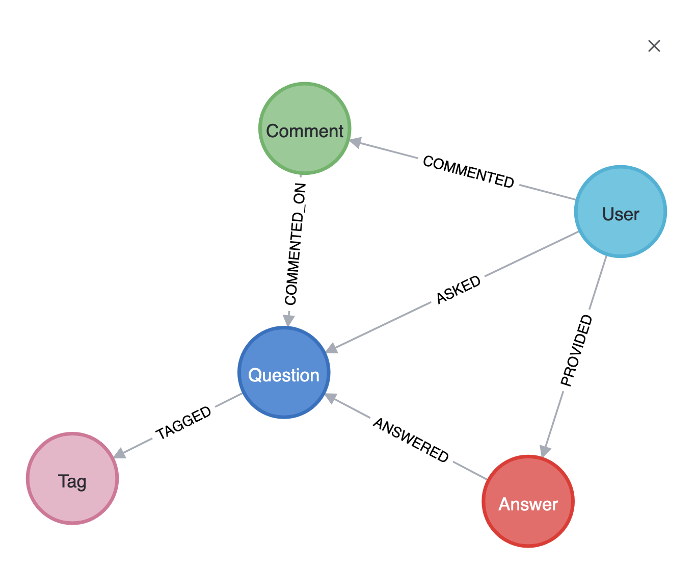

# Stack Overflow - social analysis

We work in Aura on the Stack Overflow - social analysis to illustrate


## Reset data

Before importing the new dataset

you can remove all the nodes of the northwind data with

```js
MATCH (n)
DETACH DELETE n
```

but that does not remove the nodes from the database visualization.

Alternative: go to  <https://console.neo4j.io> and delete the instance or create a new one


The Stack Overflow dataset in Neo4j illustrates several key graph concepts:  Complex relationships and path finding

- Users answering other users' questions
- Chain of knowledge transfer
- Expertise networks


Graph algorithms applications:

- Centrality (finding influential users)
- Communities of expertise
- Shortest paths between experts

Example Questions:

- Find users who answer questions in multiple technology domains
- Identify the most helpful community members (high answer/acceptance rates)
- Track knowledge flow through answer chains
- Discover topic clusters and their relationships
- Find the shortest path between two experts via their interactions

### Centrality

Centrality measures how important or influential a node is within a network based on its connections. Different types include:

- Degree centrality: Number of direct connections
- Betweenness centrality: How often a node acts as a bridge between others
- Closeness centrality: How quickly a node can reach others
- Eigenvector centrality: Influence based on connections to other influential nodes

In Stack Overflow's context, centrality helps identify key users who are vital knowledge hubs or bridge different technology communities.


- How you can model social data as graphs
- How to query the graph and answer questions using Cypher
- How to use **shortest path algorithm** to understand relationships


The model contains data about users' questions, answers, and comments about Neo4j and Cypher.
Nodes represent:

- Users
- Questions
- Answers
- Comments
- Tags



The relationships between these nodes show:

- What _User ASKED_ a Question
- What _User PROVIDED_ an Answer
- What _User COMMENTED_ to a Comment
- What _Answer ANSWERED_ a Question
- What Comment is _COMMENTED_ON_ a Question
- What Question is _TAGGED_ with a Tag

Start by showing all the users who _ASKED_ a question

```cypher
MATCH (u:User)-[a:ASKED]->(q:Question)
RETURN u,a,q
```

compare with all the users who provided an answer

```cypher
MATCH (u:User)-[p:PROVIDED]->(a:Answer)
RETURN u,p,a
```

What's the obvious observation ?

```cypher
MATCH (u:User)-[a:ASKED]->(q:Question)
RETURN u,a,q
```

Combine with **OPTIONAL MATCH** to handle cases where a user might have only questions or only answers:

and use `collect` to concatenate the questions and answers

```cypher
MATCH (u:User)
MATCH (u)-[a:ASKED]->(q:Question)
MATCH (u)-[p:PROVIDED]->(ans:Answer)
RETURN u.name, collect(DISTINCT q) as questions, collect(DISTINCT ans) as answers
```

```cypher
MATCH (u:User)
OPTIONAL MATCH (u)-[a:ASKED]->(q:Question)
OPTIONAL MATCH (u)-[p:PROVIDED]->(ans:Answer)
RETURN u.name, collect(DISTINCT q.title) as questions, collect(DISTINCT ans.title) as answers
```

or use `count`

```cypher
MATCH (u:User)
OPTIONAL MATCH (u)-[a:ASKED]->(q:Question)
OPTIONAL MATCH (u)-[p:PROVIDED]->(ans:Answer)
RETURN count(*) as totalUsers, u.id, u.name, count(q) as q_num, count(ans) as a_num
```


And counting questions

```cypher
MATCH (u:User)
OPTIONAL MATCH (u)-[:ASKED]->(q:Question)
OPTIONAL MATCH (u)-[:PROVIDED]->(a:Answer)
WITH u,
     CASE WHEN count(DISTINCT q) > 0 THEN 1 ELSE 0 END as hasQuestions,
     CASE WHEN count(DISTINCT a) > 0 THEN 1 ELSE 0 END as hasAnswers
RETURN
    count(*) as totalUsers,
    sum(hasQuestions) as usersWithQuestions,
    sum(hasAnswers) as usersWithAnswers,
    sum(CASE WHEN hasQuestions=1 AND hasAnswers=1 THEN 1 ELSE 0 END) as usersWithBoth
```


## Misc and Links

### centrality in transport networks

shortest path: p105

https://github.com/jbarrasa/gc-2022/tree/main/interop/data


### IDFM gtfs

https://data.iledefrance-mobilites.fr/explore/dataset/traces-des-lignes-de-transport-en-commun-idfm/information/?disjunctive.route_type


### Velib

https://velib-metropole-opendata.smovengo.cloud/opendata/Velib_Metropole/station_information.json

### Github Neo4j Examples

https://github.com/neo4j-graph-examples

https://github.com/neo4j-graph-examples/entity-resolution


