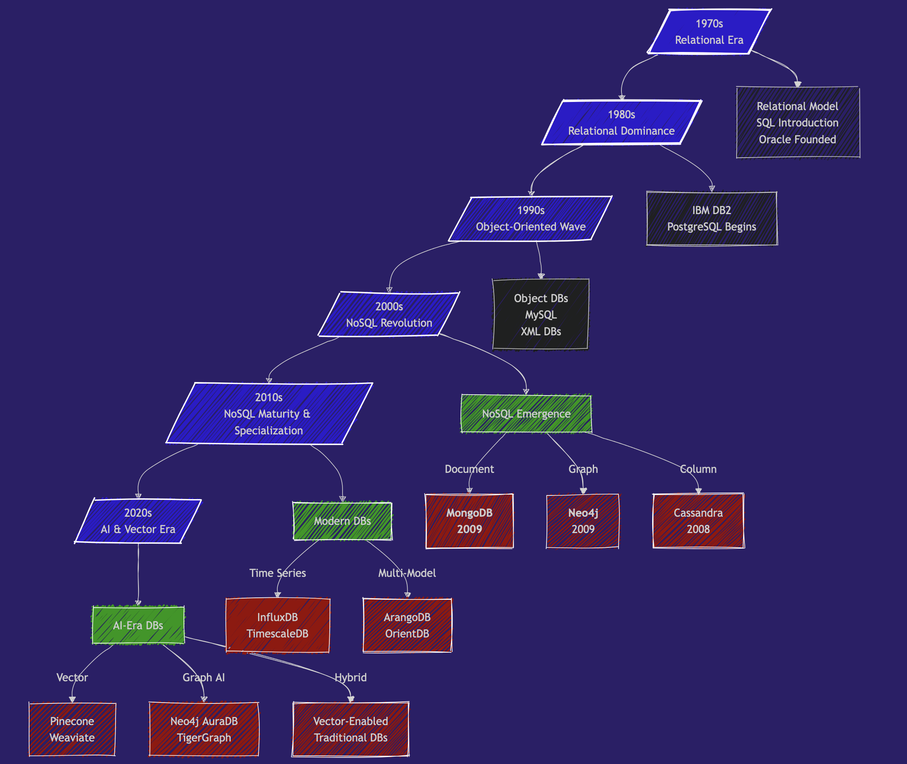
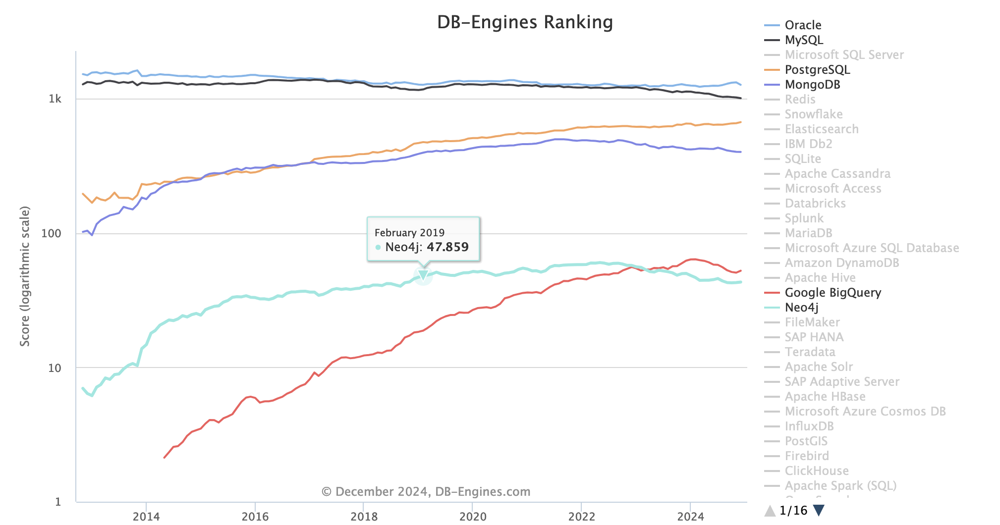
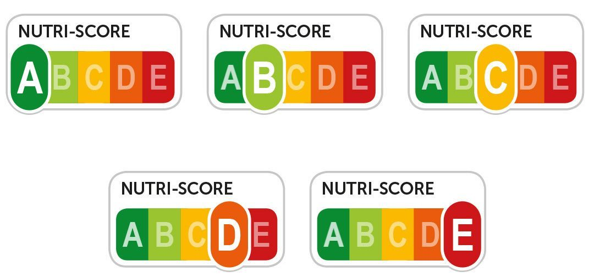
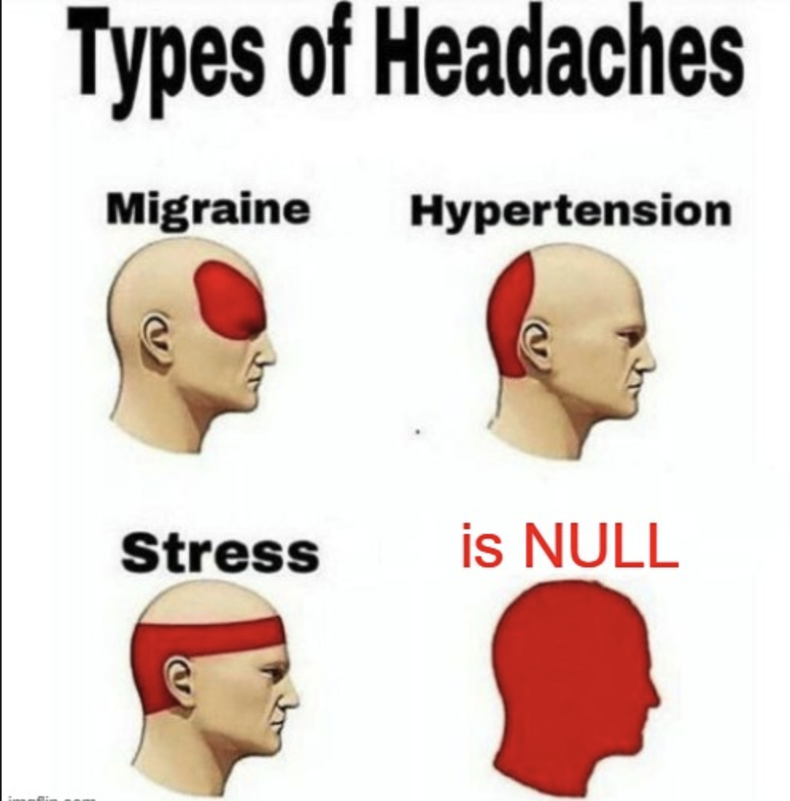
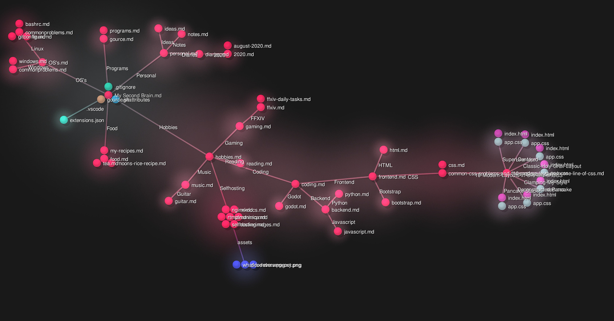

# NoSQL et bases de données graphes

Ce cours aborde deux types spécifiques de bases de données NoSQL
- MongoDB, qui est une base de données NoSQL,
- Neo4j, qui représente la famille des bases de données de type graphes (graph database).


## Qu'est-ce qu'une base de données ?


On entends parfois le mot base de données pour désigner un fichier Excel. Ca me donne des boutons.


Comment peut-on mettre quelque chose d'aussi simple qu'un fichier CSV ou Excel au même niveau que ces merveilles d'ingénierie que sont PostgreSQL, Weaviate, MongoDB, Neo4j, Redis, MySQL etc...

J'ai donc demandé à mon ami GPT-4 de me donner une définition d'une base de données :

> En termes simples :
  "Une database est comme un carnet intelligent ou un système de classement qui vous aide à garder une trace de nombreuses informations et à trouver exactement ce dont vous avez besoin en un rien de temps."

ce qui inclut définitivement les fichiers CSV, les fichiers Excel, les fichiers JSON, les fichiers XML et tant d'autres formats simples basés sur un seul fichier.

Si nous cherchons la définition d'une database dans une source de connaissance plus classique et vénérable, comme l'[Encyclopédie Britannica](https://www.britannica.com/technology/database), nous obtenons :

> base de données, toute collection de données ou d'informations spécialement organisée pour une recherche rapide par ordinateur. Les databases sont structurées pour faciliter le storage, l'extraction, la modification et la deletion des données en conjonction avec diverses opérations de traitement de données.

Voir aussi l'article database sur [Wikipedia](https://en.wikipedia.org/wiki/Database).

Très intéressant. Nous ne parlons plus seulement de trouver rapidement l'information (la partie **recherche**) mais aussi de :

- stockage
- modification
- suppression
- Administration.

C'est là qu'un simple fichier de type spreadsheet ne correspond plus à l'objectif.

## Ce que l'on attend d'un DBMS

Un système de gestion de base de données (DBMS) se distingue d'un simple spreadsheet par plusieurs fonctionnalités essentielles. Voici une comparaison détaillée :

| Feature                        | Description                                                                                                     | Excel | DBMS |
| ------------------------------ | --------------------------------------------------------------------------------------------------------------- | ----- | ---- |
| **Data Storage and Retrieval** | Stocke les données de manière organisée et les récupère selon les besoins.                                      | ✅     | ✅    |
| **Data Manipulation**          | Permet d'ajouter, modifier ou supprimer des données.                                                            | ✅     | ✅    |
| **Data Querying**              | Permet de poser des questions complexes (queries) sur les données.                                              | ✔️     | ✅    |
| **Data Organization**          | Structure les données dans des formats comme des tables, documents ou graphes pour faciliter la gestion.        | ✅     | ✅    |
| **Data Sharing**               | Permet à plusieurs utilisateurs ou applications d'utiliser la database simultanément.                           | ✅     | ✅    |
| **Data Security**              | Protège les données contre les accès non autorisés ou la corruption.                                            | ✔️     | ✅    |
| **Concurrency Control**        | Gère plusieurs utilisateurs modifiant les données en même temps sans conflits.                                  |       | ✅    |
| **Backup and Recovery**        | Garantit que les données ne sont pas perdues et peuvent être restaurées en cas de défaillance.                  | ✔️     | ✅    |
| **Data Integrity**             | Garantit que les données restent précises, cohérentes et fiables.                                               |       | ✅    |
| **Performance Optimization**   | Fournit des outils pour optimiser la vitesse et l'efficacité des retrievals et updates de données.              |       | ✅    |
| **Support for Transactions**   | Garantit qu'un groupe d'opérations (transactions) est complété entièrement ou pas du tout. <br> ACID compliance |       | ✅    |

## Un brève histoire des bases de données


> tldr; Notre cours débute il y a 15 ans, en 2009, soit 20 ans après la naissance de **PostgreSQL**.



### 1970s - Le début de l'ère relationnelle

- **1970** : **[Edgar Codd](https://en.wikipedia.org/wiki/Edgar_F._Codd)** publie "[A Relational Model of Data for Large Shared Data Banks](https://github.com/SkatAI/epita-mongodb/blob/master/pdfs/codd.pdf)"
- **1974** : **IBM** développe System R, le premier prototype de DBMS SQL
- **1979** : **Oracle** lance la première implémentation SQL commerciale

### 1980s - La domination du relationnel

- **1989** : Début du développement de Postgres (maintenant [PostgreSQL](https://www.postgresql.org/)) à UC Berkeley
  - 🎖️🎖️🎖️ database multi-usage de référence.
  - peut gérer le no-sql & vector,
  - nombreuses extensions (http, postgis, ...).
  - performances exceptionnelles.
  - et OPEN SOURCE (gratuit, efficace et sécurisé).

### 1990s - La vague orientée objet

- **1991** : Les Object-Oriented Databases gagnent en attention. <br> La plupart des OODBs des années 90 ne sont plus utilisées. Mais elles ont influencé l'évolution des databases SQL et NoSQL.
- **1995** : MySQL est publié en open source

### 2000s - Le début de la révolution NoSQL

- 2 papers importants qui posent les bases des systèmes NoSQL : [BigTable paper](https://research.google.com/archive/bigtable-osdi06.pdf) (Google, 2004) et [Dynamo paper](https://www.amazon.science/publications/dynamo-amazons-highly-available-key-value-store) (Amazon, 2007)

Et en **2009**, 2 nouvelles databases sont lancées :

- 🥭🥭🥭 MongoDB
- 🎉🎉🎉 Neo4j

Tadaaah !


#### Pourquoi à ce moment-là ?

L'essor du world wide web (myspace 😍, youtube - 2005) et l'augmentation massive de l'échelle des applications de plusieurs ordres de grandeur.

Soudainement, nous avons des millions de personnes qui tentent simultanément d'accéder et de modifier des Terabytes de données en quelques millisecondes.

Les databases relationnelles ne peuvent pas suivre l'échelle des applications, la nature chaotique des données non structurées et les exigences de vitesse.

La promesse du NoSQL est le **volume et la vitesse**.

### 2010s - Le NoSQL arrive à maturité & Spécialisation - Big Data et Databases Spécialisées

- **Big Data Databases** : Des systèmes comme **Apache Hadoop** (2006) et **Apache Spark** (2009) ont permis le traitement de données à très grande échelle.
- Les **Graph Databases** gagnent en popularité avec des cas d'usage comme la détection de fraude, les knowledge graphs, et la gestion de la chaîne d'approvisionnement. Neo4j et Amazon Neptune deviennent des acteurs clés.
- **Time-Series Databases (ex : InfluxDB, TimescaleDB)** : conçues pour les systèmes de monitoring : IoT, logs, ...
- **Cloud Databases** : services managés comme Amazon **RDS**, Google **BigQuery**, ou **Snowflake**

et entre-temps, en 2013, les containers **Docker** révolutionnent le déploiement des databases

### **2020s : IA, Vector Databases, et Besoins Temps Réel**

- **Vector Databases** 🌶️🌶️🌶️ (ex : Pinecone, Weaviate, Qdrant, Milvus, Faiss, ...) :
  - Gèrent les vector embeddings de haute dimension utilisés dans les applications AI/ML

- et aussi :
  - 🌶️🌶️🌶️ **Graph + AI** : 🌶️🌶️🌶️ knowledge graphs et LLMs.
  - Multi-Model Databases qui supportent plusieurs modèles de données (document, graph, key-value) dans un seul système.
  - Real-Time Analytics : optimisés pour le streaming de données en temps réel et l'analytique.
  - Serverless Databases

### Tendances Actuelles (2024)

La vector search est en plein essor. Les capacités de vector search sont intégrées dans la plupart des DBMS existants, y compris PostgreSQL, MongoDB et Neo4j.


### En Bref

- 1989 : Lancement de PostgreSQL
- 2009 : Lancement de MongoDB et Neo4j
- 2024 : les vector databases sont en vogue tandis que les databases plus anciennes intègrent la vector search

## Catégories principales de databases aujourd'hui

Nous avons de nombreuses databases parmi lesquelles choisir. Tout dépend de l'échelle, de la nature de l'application, du budget, etc.

| Type de Database          | Objectif                                   | Exemples                  | Application                                |
| ------------------------- | ------------------------------------------ | ------------------------- | ------------------------------------------ |
| **Relational - SQL**      | Schema fixe                                | PostgreSQL, MySQL, Oracle | Transactions, normalisation                |
| **Document Stores**       | Schema flexible, documents type JSON       | MongoDB, CouchDB          | Applications web, gestion de contenu       |
| **Graph Databases**       | Données centrées sur les relations         | Neo4j, ArangoDB           | Réseaux sociaux, moteurs de recommandation |
| **Key-Value Stores**      | Recherches simples et rapides              | Redis, DynamoDB           | Caching, gestion des sessions              |
| **Vector Databases**      | Recherche par similarité, AI embeddings    | Pinecone, Weaviate        | Applications IA, recherche sémantique      |
| **Column-Family Stores**  | Données colonnes larges, haute scalabilité | Cassandra, HBase          | Time-series, applications big data         |
| **Time-Series Databases** | Données ordonnées dans le temps            | InfluxDB, TimescaleDB     | IoT, systèmes de monitoring                |


### Écosystème

Consultez le classement de toutes les databases sur <https://db-engines.com/en/ranking>

Les tendances : <https://db-engines.com/en/ranking_trend>



De très nombreux acteurs :


source : <https://www.generativevalue.com/p/a-primer-on-databases>

Prenons du recul et comparons une database relationnelle SQL et une database NoSQL.

## SQL

Une database relationnelle :

- utilise un **schema** prédéfini : la structure des données (colonnes, types de données, etc.) est fixe.
- est excellente pour les queries complexes, les transactions et assurer la cohérence des données (conformité ACID).

Une **database relationnelle** peut être comparée à une collection de spreadsheets bien organisés (tables) où chaque colonne est définie, et les feuilles sont interconnectées.

Les tables ont des colonnes et des lignes de données. Chaque table a une clé unique appelée **primary key**.

La conception du schema concerne la (dé)normalisation. Décider où une information doit résider de manière unique ou non.

> Concept important de **Normalisation** : une information n'existe qu'à un seul endroit et un seul.

### Hiérarchie d'une Database SQL :

- Une **foreign key** lie une table à une autre table
- Une **row** contient la valeur d'une _entity_
- Une **column** est un **attribute** ou une propriété de l'_entity_
- Une **table** contient toutes les entities regroupées dans une structure fixe de colonnes

Les databases SQL = rigides, contrôlées, données cohérentes, stables, mais peuvent être complexes.

## NoSQL

Une **database non-relationnelle** est un système de dossiers flexible où vous pouvez stocker des éléments de différentes formes sans règles strictes.

- **schema flexible** avec données non structurées ou semi-structurées
- idéal pour la haute scalabilité et la gestion de charges de travail massives et **distribuées**.

Pensez aux documents (JSON) plutôt qu'aux tables.

- Une **collection** est un ensemble de **documents**.
- Un document est une combinaison de keys : values.
- Chaque collection a une clé unique (le champ _id)
- Dans un document, vous pouvez avoir des subdocuments imbriqués. Une personne peut avoir plusieurs téléphones, adresses email, emplois, ...

Tous les documents d'une collection sont **similaires en structure** mais n'ont pas besoin d'être exactement identiques.

Il n'y a pas de concept de normalisation.

### Hiérarchie de MongoDB - Database NoSQL - MongoDB

- Une **database** contient des **Collections**
- Une **collection** contient tous les **documents**
- Un **document** est l'entity ou la valeur de données
- Un subdocument (imbriqué) est un document **à l'intérieur** d'un document parent
- Un **field** est un attribute ou une propriété du document

Les databases NoSQL = fluides, adaptatives, flexibles.

### Terminologie

MongoDB - SQL :

- Un `document` est un record, une row
- Une `Collection` est une table
- Un `Field` est une Column

| MongoDB           | SQL Database |
| ----------------- | ------------ |
| Database          | Database     |
| Collection        | Table        |
| Document          | Record/Row   |
| Field             | Column       |
| Embedded Document | Foreign Key  |
| `_id`             | Primary Key  |
| `$lookup`         | JOIN         |

Un `index` reste un `index`


## Schema-less ou schema dynamique

Dans quelles situations les données sont-elles si dynamiques qu'il nous faut un type spécial de databases ?

L'exemple le plus courant d'application NoSQL est celui d'un réseau social.

- profils utilisateurs
- les posts contiennent toutes sortes de contenu
- timeline, followers, etc

### Yuka et les produits alimentaires

Prenons l'exemple d'une start-up comme [Yuka](https://yuka.io/en/)


Selon leurs propres mots : _Yuka déchiffre les étiquettes des produits et analyse l'impact sur la santé des produits alimentaires et cosmétiques._

Sa database sous-jacente est la [open food facts database](https://world.openfoodfacts.org/), une database de produits alimentaires faite par tous, pour tous, avec plus de 3,5 millions de produits alimentaires.

Regardez par exemple les informations pour [Nutella](https://uk.openfoodfacts.org/product/3017620422003/nutella) et celles pour... [Baguette](https://world.openfoodfacts.org/product/3250393046940/baguette-constance-cereales-250g-la-campaniere)

Voir aussi cet article qui explore le dataset avec python pandas : https://medium.com/@achrafelkhanjari99/a-deep-dive-into-the-open-food-facts-dataset-56259b162ac5 (disponible en pdf sur le repo Github)

Avec autant de produits, les informations disponibles et les informations associées (Packaging, Impact Carbone) ainsi que la diversité des réglementations (UE, US, UK, ... etc) varient constamment.

Les données sont constamment mises à jour tout en gardant l'historique des changements et des nouveautés.

- de nouvelles données deviennent disponibles au fur et à mesure que les acteurs mettent en place la collecte de données. Pensez traçabilité, sécurité, etc
- les nouvelles réglementations imposent plus de données
- l'actualité, les tendances sociales et les centres d'intérêt changent rapidement (sans gluten, thon et mercure, ...)

Vous commencez donc votre database avec un schema simple qui inclut :

- nom, définition, image, description
- valeurs nutritionnelles
- ingrédients

Mais le schema devient de plus en plus complexe à mesure que les données et les produits et services de l'entreprise évoluent.

#### Nutriscore

Prenons par exemple le label Nutriscore :



Le [Nutriscore](https://nutriscore.blog/2022/08/04/report-of-the-european-scientific-committee-in-charge-of-updating-the-nutri-score-changes-to-the-algorithm-for-solid-foods/) a récemment évolué avec une nouvelle version plus stricte. Vous avez besoin des nouveaux labels Nutriscore tout en gardant l'ancien car tous les produits n'implémentent pas le nouveau Nutriscore. Certaines entreprises ont même complètement abandonné l'étiquetage.

Vous avez commencé avec une table Nutriscore dans une database SQL :

```sql
product_id: key
nutriscore_label : array[A,B, .., E]
```

donc votre table Nutriscore nécessite une nouvelle colonne :

```sql
product_id: key
nutriscore_label: array[A,B, .., E]
nutriscore_new_label: array[A,B, .., E]
```

Cependant, la plupart des produits n'ont pas encore de nouveau label nutriscore.

Et vous vous retrouvez avec beaucoup de null values dans cette colonne `nutriscore_new_label` et les null values sont diaboliques 👹👹👹.



Vous pouvez aussi normaliser la table et introduire une colonne version du Nutriscore pour aider avec les Null values.

```sql
product_id: key
nutriscore_label: array[A,B, .., E]
nutriscore_version: Int
```

Dans les deux cas, vous devez changer toutes vos SQL queries dans votre code base.

Grosse douleur, gros tracas, maux de tête, bugs cachés et coûts supplémentaires ＄＄＄.

## Introduction à la Schema Flexibility

La **Schema Flexibility** dans MongoDB et d'autres databases NoSQL fait référence à la capacité de stocker des données sans nécessiter un schema prédéfini. Cela signifie que les documents d'une même collection peuvent avoir différents fields, structures et types de données.

La Schema Flexibility aide à gérer les **unknown unknowns** dans un monde qui change rapidement.

### Présence et type de données

Dans MongoDB : Vous pouvez simplement ajouter un nouvel élément Nutriscore aux produits alimentaires :

Pas de Nutriscore

```json
{
  "product_id": 198273,
  "name": "Corn Flakes Cereals",
}
```

Le Nutriscore est ajouté, il suffit d'ajouter un field au document du produit

```json
{
  "product_id": 198273,
  "name": "Corn Flakes Cereals",
  "Nutriscore": "C"
}
```

Une nouvelle version du Nutriscore arrive, il suffit d'ajouter le label Nutriscore comme un dictionary avec les versions comme keys :

```json
{
  "product_id": 198273,
  "name": "Corn Flakes Cereals",
  "Nutriscore": {
    "v1": C,
    "v2": D,
  }
}
```

Plusieurs représentations peuvent **coexister** dans la même database :

- Pas de nutriscore
- Un seul nutriscore comme string
- Un dictionary nutriscore comme document nested / embedded

### Données Nested / Complexes

- SQL nécessite une normalisation en plusieurs tables pour les structures complexes
- MongoDB peut naturellement **nested** les données liées

Un autre exemple est celui de l'adresse d'une personne

```json
// Une personne sans adresse enregistrée
{
    "_id": "1",
    "name": "Anita Sharma",
    "age": 29,
    "email": "anita.sharma@example.com"
}

// Une personne avec une seule adresse comme dictionary
{
    "_id": "2",
    "name": "Rahul Verma",
    "age": 42,
    "email": "rahul.verma@example.com",
    "addresses": {
        "type": "home",
        "street": "12 MG Road",
        "locality": "Indiranagar",
        "city": "Bengaluru",
        "state": "Karnataka",
        "pincode": "560038",
        "country": "India"
    }
}

// Une personne avec plusieurs adresses comme liste de dictionaries
{
    "_id": "3",
    "name": "Priya Singh",
    "age": 35,
    "email": "priya.singh@example.com",
    "addresses": [
        {
            "type": "home",
            "street": "45/2 Lajpat Nagar",
            "locality": "Central Market",
            "city": "New Delhi",
            "state": "Delhi",
            "pincode": "110024",
            "country": "India"
        },
        {
            "type": "work",
            "street": "4th Floor, Tower B",
            "locality": "DLF Cyber City",
            "city": "Gurugram",
            "state": "Haryana",
            "pincode": "122002",
            "country": "India"
        }
    ]
}
```

### Conséquences de la schema flexibility

La Schema Flexibility impacte chaque étape du cycle de vie d'une database

- **Design** : sans règles claires, tout devient possible. Les choix de conception sont dictés par l'application. La façon dont les données sont _consommées_ dicte la structure des données dans la database.
- **Development** : avec un schema flexible, les changements peuvent être implémentés plus rapidement.
- **Maintenance** : l'inconvénient est la nécessité de gérer l'organisation et les types de données plus anciens

Une prudence supplémentaire est nécessaire pour éviter le chaos et les **data inconsistencies**. La performance des queries peut être affectée si les changements dans la structure des données conduisent à un indexing inefficace ou incohérent.

Avec les databases NoSQL, le coût de l'implémentation des changements dans la nature des données est déplacé de la database vers le niveau applicatif.

Cependant, des inconsistencies dans la database peuvent toujours survenir si plusieurs applications interagissent différemment avec la même database.

> En bref, la schema flexibility doit être utilisée avec précaution et uniquement lorsque c'est utile et justifié.

## Quand choisir NoSQL (document database) plutôt que SQL ?

Alors quand est-ce qu'une Document database NoSQL est un meilleur choix que SQL ?

- Vos données correspondent naturellement à une structure de **document** plutôt qu'à des tables strictes
  - Vous voulez stocker les données liées ensemble plutôt que de les répartir dans des tables pour accélérer la récupération d'information. queries plus simples, moins de joins, moins de complexité de code.

- Itération Rapide : Votre schema doit évoluer rapidement et vous privilégiez la vitesse de développement à la stricte cohérence des données
  - Applications et exigences de données qui changent rapidement
  - Startups en phase initiale où le modèle de données n'est pas encore pleinement compris

- également : A/B testing de différentes fonctionnalités qui peuvent nécessiter différentes structures de données

- Scalabilité et Performance
  - Conçu pour le **horizontal scaling** avec support intégré du **sharding** (distribution des données sur plusieurs serveurs).
  - Adapté à la gestion d'applications à grande échelle, haut débit et géographiquement distribuées.

MongoDB scale out, tandis que PostgreSQL scale up.

- Utilise un modèle de document flexible de type JSON (BSON), le rendant idéal pour les données hiérarchiques ou semi-structurées.
  - Réduit le besoin de joins complexes, car les données liées peuvent être embedded dans un seul document.

MongoDB excelle dans :

- Les applications avec des données non structurées ou semi-structurées.
- Les charges de travail à haute vélocité nécessitant des changements rapides de schema.
- Les cas d'utilisation nécessitant un horizontal scaling dans des environnements distribués.

### Performance

En termes de performance, la comparaison favorise la plupart du temps PostgreSQL par rapport à MongoDB.
voir [MongoDB Vs PostgreSQL: A comparative study on performance aspects](https://link.springer.com/article/10.1007/s10707-020-00407-w)

Et cet autre article, [MongoDB vs PostgreSQL: Choosing the Best Database for Your Needs](https://www.halfnine.com/blog/post/mongodb-vs-postgresql), le résume bien :

> _MongoDB brille dans les scénarios nécessitant le développement d'applications logicielles qui traitent divers types de données de manière évolutive. Il est particulièrement adapté aux projets qui doivent supporter un développement itératif rapide et faciliter la collaboration de nombreuses équipes.

Dans [Postgres vs. MongoDB: a Complete Comparison in 2024](https://www.bytebase.com/blog/postgres-vs-mongodb/)

### En bref

- Choisissez MongoDB si votre application a un modèle de données simple et gère des données à l'échelle du web.
- Choisissez PostgreSQL si votre application a une logique métier complexe et nécessite des requêtes complexes.

## Qu'en est-il des bases de données graphes ?

Les bases de données SQL sont appelées bases de données relationnelles.

Dans une base de données SQL, la relation entre les tables est explicitement définie par des clés étrangères.

- Product -> Vegetables -> Location, Origin
- Product -> Vegetables -> Organic / not Bio
- Product -> nutrition (sugar, fat etc)
- Product -> Nutriscore labels
- Product -> ConsumeBy

Et l'ERD pour une telle base de données indique uniquement la cardinalité de la relation :

- 1 to 1
- 1 to many


Quand vous demandez à un LLM de générer un diagramme pour une base de données de produits, il ajoute naturellement des informations significatives aux relations entre les tables.


[Mermaid](https://mermaid.live) diagram

### Relationships

Les bases de données graphes sont centrées sur la _signification_ des **relations** entre entités.

> Dans les bases de données graphes comme Neo4j, les **relations** sont aussi importantes que les données elles-mêmes et sont stockées explicitement.

Ces relations ont leurs propres propriétés et sont stockées comme des connexions.

Alors qu'en SQL :

- Les relations sont implicites via des clés étrangères
- Doivent être reconstruites via des JOINs
- Deviennent exponentiellement plus complexes et lentes lorsque vous suivez plusieurs niveaux de connexions

C'est pourquoi Neo4j excelle dans les questions comme :

- "Trouvez tous les amis d'amis qui aiment courir et vivent à Paris"
- "Quel est le chemin le plus court entre la personne A et la personne B ?"
- "Qui sont les personnes les plus influentes dans ce réseau ?"

Voici un exemple de graphe de connaissances avec Obsidian



Nous reviendrons sur Neo4j dans 2 semaines.

## conclusion

Donc les bases de données SQL, dites relationnelles, sont excellentes pour les structures de données qui ne changent pas souvent et où les relations entre objets sont stables.

Les bases de données No-SQL comme MongoDB : excellentes quand les spécifications des données évoluent rapidement ou ne sont pas définitives, schéma flexible, grande échelle

Bases de données graphes : la relation est clé. Ce n'est pas seulement qu'il y a une relation mais aussi quelle est la nature de cette relation.

- NoSQL - Document concerne l'évolutivité et l'évolution des données.
- Graph concerne la réponse à des questions spécifiques, la découverte de différents types de signification et d'aperçus dans les données.

Dans cette session, vous avez appris :

- DBMS et l'histoire des bases de données
- Un aperçu des différents types de bases de données
- Base de données relationnelle vs non relationnelle
- Schéma flexible dans les bases de données NoSQL

- Pourquoi et quand choisir MongoDB plutôt que SQL
